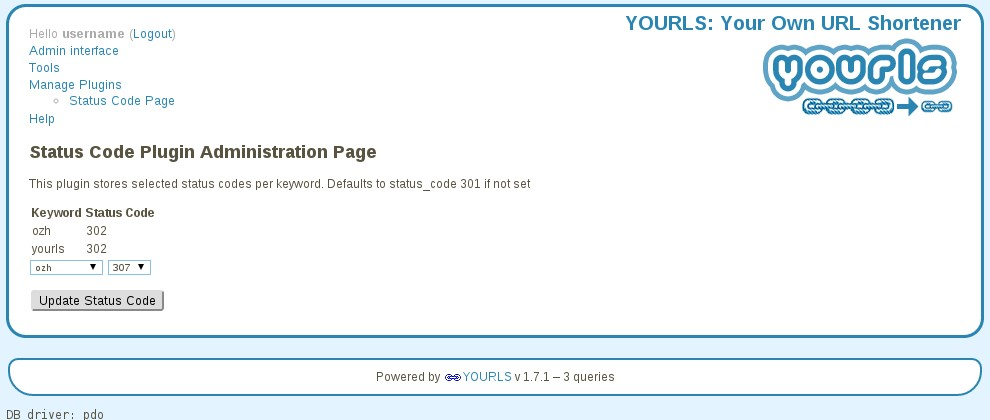

YOURLS-filter-code
==================

Yourls plugin to allow you to select 3XX Status Code to return per keyword.

Plugin tested for YOURLS 1.7


#### Installation
In `/user/plugins`, create a new folder named `filter-code`.  
Drop these files in that directory.  
Go to the Plugins administration page (*Manage Plugins*)->and activate the plugin: *Status Code by Keyword*.  
After activation, you should see *Status Code Page* listed as a page under *Manage Plugins*

#### Status Code Page Usage
Add a keyword to 3XX status codes associations from the dropdowns presented.  The 
table will show any existing mapping.  If no mapping is shown or defined, `301` is used as the default code.

#### Screen Shot - Admin Page


#### Why use 301 as the default code?
301 - Moved Permanently is used as it will let your browser know that it doesn't have to keep looking up the short url mapping but can cache it internal to the browser itself.  

#### How to test

````bash
curl <base_url>/shortkey
````

or

````
wget <base_url>/shortkey
````

#### Troubleshoot the Database
````bash
prompt> mysql
shell>
````
